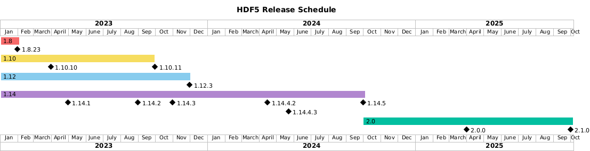

HDF5 version 1.15.0 currently under development

*Please refer to the release_docs/INSTALL file for installation instructions.*

This repository contains a high-performance library's source code and a file format
specification that implement the HDF5® data model. The model has been adopted across
many industries and this implementation has become a de facto data management standard
in science, engineering, and research communities worldwide.

The HDF Group is the developer, maintainer, and steward of HDF5 software. Find more
information about The HDF Group, the HDF5 Community, and other HDF5 software projects,
tools, and services at [The HDF Group's website](https://www.hdfgroup.org/). 

DOCUMENTATION
-------------
This release is fully functional for the API described in the documentation.

   https://portal.hdfgroup.org/display/HDF5/The+HDF5+API

Full Documentation and Programming Resources for this release can be found at

   https://portal.hdfgroup.org/display/HDF5

The latest doxygen documentation generated on changes to develop is available at:

   https://hdfgroup.github.io/hdf5/

See the [RELEASE.txt](/release_docs/RELEASE.txt) file in the [release_docs/](/release_docs/) directory for information specific
to the features and updates included in this release of the library.

Several more files are located within the [release_docs/](/release_docs/) directory with specific
details for several common platforms and configurations.

    INSTALL - Start Here. General instructions for compiling and installing the library
    INSTALL_CMAKE  - instructions for building with CMake (Kitware.com)
    INSTALL_parallel - instructions for building and configuring Parallel HDF5
    INSTALL_Windows and INSTALL_Cygwin - MS Windows installations.

HELP AND SUPPORT
----------------
Information regarding Help Desk and Support services is available at

   https://portal.hdfgroup.org/display/support/The+HDF+Help+Desk

FORUM and NEWS
--------------
The [HDF Forum](https://forum.hdfgroup.org) is provided for public announcements and discussions
of interest to the general HDF5 Community.

   - News and Announcements
   https://forum.hdfgroup.org/c/news-and-announcements-from-the-hdf-group

   - HDF5 Topics
   https://forum.hdfgroup.org/c/hdf5

These forums are provided as an open and public service for searching and reading.
Posting requires completing a simple registration and allows one to join in the
conversation.  Please read the [instructions](https://forum.hdfgroup.org/t/quickstart-guide-welcome-to-the-new-hdf-forum
) pertaining to the Forum's use and configuration.

RELEASE SCHEDULE
----------------

 

HDF5 does not release on a regular schedule. Instead, releases are driven by
new features and bug fixes, though we try to have at least one release of each
maintenance branch per year. Future HDF5 releases indicated on this schedule
are tentative.

| Release | New Features |
| ------- | ------------ |
| 1.10.11 | CVE fixes, last HDF5 1.10 release |
| 1.12.3 | CVE fixes, performance improvements, H5Dchunk\_iter(), last HDF5 1.12 release |
| 1.14.3 | CVE-free!, better cross-compile support |
| 1.14.4 | S3 VFD improvements |
| TBD | VFD SWMR |
| 2.0.0 | TBD |

This list of feature release versions is also tentative, and the specific release
in which a feature is introduced may change.

SNAPSHOTS, PREVIOUS RELEASES AND SOURCE CODE
--------------------------------------------
Periodically development code snapshots are provided at the following URL:
    
   https://github.com/HDFGroup/hdf5/releases/tag/snapshot

Source packages for current and previous releases are located at:
    
   https://portal.hdfgroup.org/display/support/Downloads

Development code is available at our Github location:
    
   https://github.com/HDFGroup/hdf5.git

