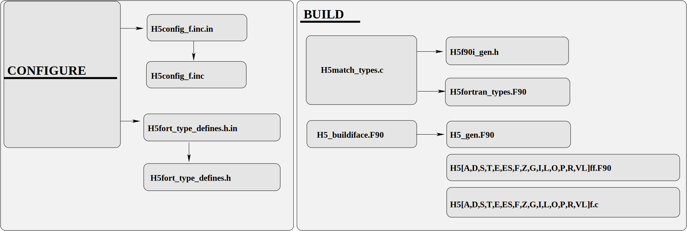

Information about the Fortran APIs
===================================

This directory contains Fortran APIs for HDF5 Library functionality.
A complete list of implemented Fortran subroutines can be found in the HDF5
Reference Manual.

About the source code organization
----------------------------------

The Fortran APIs are organized in modules parallel to the HDF5 Interfaces.
Each module is in a separate file with the name H5\*ff.F90.  Corresponding C
stubs are in the H5\*f.c files.  For example, the Fortran File APIs are in
the file H5Fff.F90, and the corresponding C stubs are in the file H5Ff.c.

Each module contains Fortran definitions of the constants, interfaces to
the subroutines if needed, and the subroutines themselves.

It is crucial for users to use constant names in their programs instead
of the numerical values, as the constant names have values which are
subject to change without notice.

Quick overview of the Fortran APIs
----------------------------------

*  An in-depth description of each Fortran API and its parameters can
   be found in the HDF5 Reference Manual. They tend to be summarized
   from the C descriptions.

*  The Fortran APIs come in the form of Fortran subroutines.

*  Each Fortran subroutine name is derived from the corresponding C function
   name by adding "_f" to the name.  For example, the name of the C function
   to create an HDF5 file is H5Fcreate;  the corresponding Fortran subroutine
   is h5fcreate_f.

*  The parameter list for each Fortran subroutine usually has two more parameters
   than the corresponding C function.  These additional parameters typically hold
   the return value and an error code.  The order of the Fortran subroutine
   parameters may differ from the order of the C function parameters.

   The Fortran subroutine parameters are usually listed in the following order:

      * required input parameters,
      * output parameters, including return value and error code, and
         optional input parameters.

   For example, the C function to create a dataset has the following
   prototype:

       hid_t H5Dcreate2(hid_it loc_id, char *name, hid_t type_id,
             hid_t space_id, hid_t link_creation_prp, hid_t dset_creation_prp,
             hid_t dset_access_prop);

   The corresponding Fortran subroutine has the following form:

       SUBROUTINE h5dcreate_f(loc_id, name, type_id, space_id, dset_id, &
       hdferr, dset_creation_prp, link_creation_prp, dset_access_prop)

   The first four parameters of the Fortran subroutine correspond to the
   parameters of the C function. The fifth parameter, dset_id, is an output
   parameter containing a valid dataset identifier, and the sixth
   output parameter, hdferr, indicates successful completion.
   The error code descriptions can be found in the subroutine descriptions
   of the Reference Manual. The last three input parameters are optional
   and can be omitted, in which case default values will be used.

*  Parameters to the Fortran subroutines typically include
   predefined datatypes (see the build-time generated file
   H5fortran_types.F90 for a complete listing):

        INTEGER(HID_T)      compares with hid_t type in HDF5 C APIs
        INTEGER(HSIZE_T)    compares with hsize_t in HDF5 C APIs
        INTEGER(HSSIZE_T)   compares with hssize_t in HDF5 C APIs
        INTEGER(SIZE_T)     compares with the C size_t type

   These integer types usually correspond to 4- or 8-byte integers,
   depending on the Fortran compiler and corresponding HDF5
   C library definitions.

*  Before calling HDF5 Fortran subroutines, each Fortran application must initialize Fortran datatypes
   by calling the h5open_f subroutine. After all calls to the HDF5 Fortran Library, the application
   should call the h5close_f subroutine.

*  All public APIs for the Reference Manual have Doxygen descriptions and should use parameter aliases when possible.

*  When a C application reads data stored by a Fortran program, the data appears
   to be transposed. This is because C and Fortran have different storage orders
   (row-major and column-major, respectively). For instance, if a Fortran program
   writes a 4x6 two-dimensional dataset to a file, a C program will read it into
   memory as a 6x4 two-dimensional dataset. The HDF5 C utilities h5dump and h5ls
   display transposed data if it was written from a Fortran program.

*  It is important to note that in Fortran, the indexing of arrays starts at 1.

FOR DEVELOPERS
==============

* The build system generates APIs compatible with Fortran 90 to handle the backward compatibility
  of the older F90 APIs. During the configuration process, the build system determines all
  valid integer and real KINDs, as well as the maximum decimal precision for reals and floats
  in both Fortran and C.  To determine all the available kinds, the Fortran program
  *PROGRAM FC_AVAIL_KINDS* is used, which is located in aclocal_fc.f90. The available KINDs
  are stored in H5config_f.inc, a file processed during configuration time from
  H5config_f.inc.in. Each program in m4/aclocal_fc.f90 is enclosed with a
  "!---START-----+" line and a "!---END-------+" line, which are used as markers to
  isolate each test program for the build systems.

  The valid KINDs for integers and reals that are stored in H5config_f.inc are used in the H5_buildiface.F90 file located in the fortran/src directory. During the build process, H5_buildiface.F90 generates all the valid F90 KIND interfaces for the following APIs: h5awrite_f, h5aread_f, h5dwrite_f, h5dread_f, h5pset_fill_value_f, h5pget_fill_value_f, h5pset_f, h5pget_f, h5pregister_f, and h5pinsert_f. These APIs can handle up to and including rank seven arrays for all the found KINDs. Again, it's important to note that no new Fortran APIs should be added to H5_buildiface.F90 since new Fortran APIs should not use F90 specification but should instead use F2003. The source file generated by H5_buildiface.F90 is H5_gen.F90, which is the Fortran module H5_GEN, Figure 1. This module is included in the HDF5 module HDF5.F90.

  

Procedure to add a new function
--------------------------------

> [!IMPORTANT]  
> The use of C stubs (H5\*f.c) is no longer recommended. The C APIs should now be called from Fortran wrappers. C wrappers description exists for maintenance purposes and to create and understand alternative development options.

1. Edit the fortran/src/H5\*ff.F90 file
2. Edit the fortran/src/H5\*f.c file
3. Edit the fortran/src/H5f90proto.h file
4. Add the new function to fortran/src/hdf5_fortrandll.def.in

Procedure for passing C variables to Fortran
---------------------------------------------

(1) Find the C struct name you are interested in:

        (a) src/H5public.h if it is a generic type, i.e. H5_*
            or
        (b) src/H5*public.h if is a specific type, i.e. H5*_

(2) Put that structure into an array that will be passed to Fortran in:

        (a) fortran/src/H5_f.c (add to the h5init_flags_c subroutine)
        (b) edit fortran/src/H5f90proto.h and edit h5init_flags_c interface call

(3) Edit the function call in fortran/src/H5_ff.F90

        (a) edit the call:  FUNCTION h5init_flags_c
        (b) edit h5init_flags_c call in h5open_f to match the number of arguments being passed

(4) Add the size of the array and array to fortran/src/H5f90global.F90, it must match the size found in H5_f.c

> [!NOTE]  
> To add a default C value argument, do steps (2a) and (4).

Procedure for adding a new file to the repository
--------------------------------------------------

Add the name of the file to the:
    (1) Makefile.am located in the same directory as the new file.
    (2) CMakeLists.txt located in the same directory as the new file.
